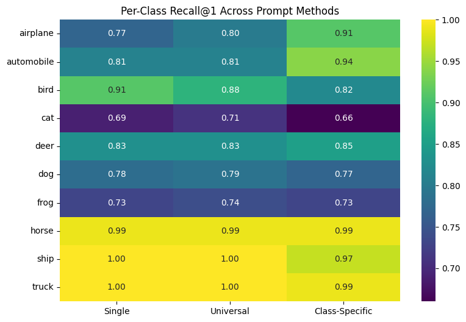
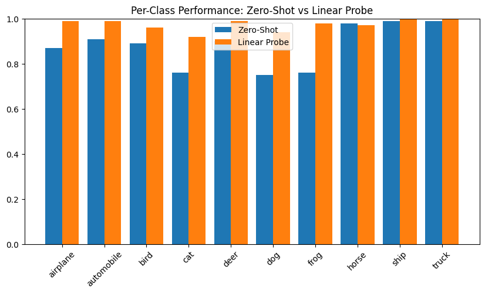

# Zero-Shot vs Linear Probe Comparison using CLIP (ViT-B/32)

## Clear Summary

This project investigates whether prompt engineering can improve the performance of a zero-shot CLIP model on low-resolution CIFAR-10 images, and compares it against a supervised linear probe classifier trained on frozen CLIP image embeddings.

Using 1000 fixed CIFAR-10 images, three prompting strategies were evaluated:

- Single Canonical Prompt  
- Universal Prompt Ensemble  
- Class-Specific Prompt Ensemble  

The best zero-shot method (Class-Specific Prompt Ensemble) improved Recall@1 from 0.851 to 0.863. However, a supervised linear probe significantly outperformed all zero-shot methods, correcting 97 out of 120 zero-shot errors.

The results show that prompt engineering helps, especially for visually ambiguous animal classes, but cannot fully compensate for CIFAR-10’s low resolution (32×32 images).

---

## Plain Language Explanation

### What is CLIP?

CLIP (Contrastive Language–Image Pretraining) is a vision-language model trained to connect images and text.

Instead of learning from traditional labeled datasets, CLIP was trained on millions of image–text pairs from the internet. It learns by matching images to their correct text descriptions.

In simple terms:

- CLIP turns images into numbers (image embeddings).
- CLIP turns text into numbers (text embeddings).
- If the numbers are similar, the image and text likely match.

It uses:
- A Vision Transformer for images  
- A Text Transformer for text  

Both produce 512-dimensional vectors that are compared using cosine similarity.

---

### What is Zero-Shot Learning?

Zero-shot learning means making predictions without training on the target dataset.

Instead of training on CIFAR-10 directly:

1. We write prompts like "a photo of a dog"
2. Convert them into embeddings
3. Compare them with image embeddings
4. Rank by similarity

No model weights are updated.

---

## Dataset

CIFAR-10

- 60,000 colour images  
- 32×32 resolution  
- 10 classes  
- 1000 fixed test images (100 per class, seed = 0)  
- 2000 images used for linear probe training  

No fine-tuning of CLIP was performed.

---

## Models Compared

1. Single Canonical Prompt  
2. Universal Prompt Ensemble  
3. Class-Specific Prompt Ensemble  
4. Supervised Linear Probe  

---

## Results (Macro Average)

| Model                   | Recall@1 | Recall@5 |
|--------------------------|----------|----------|
| Single Prompt           | 0.851    | 0.996    |
| Universal Ensemble      | 0.855    | 0.992    |
| Class-Specific Ensemble | 0.863    | 0.997    |
| Linear Probe            | Highest overall |

Key findings:

- Prompt ensembling improves performance.
- Class-specific prompts perform best.
- Animal classes benefit most from richer descriptions.
- Frog remains the hardest class.
- Linear probe significantly reduces errors.

---

## Per-Class Recall Across Prompt Methods

---

## Per-Class Performance: Zero-Shot vs Linear Probe

---

## Error Analysis

- Zero-shot errors: 120  
- Linear probe errors: 26  
- Errors fixed by linear probe: 97  
- Shared errors: 23  

This shows many zero-shot errors come from text-image misalignment rather than visual failure.

---

## Error Overlap Between Prompting Strategies

---

## What I Learned

1. Prompt engineering measurably affects performance.  
2. Zero-shot models are powerful but sensitive to wording.  
3. Low resolution is a major bottleneck.  
4. Supervised learning remains stronger when labels are available.  
5. Error overlap analysis reveals whether improvements come from alignment or feature adaptation.

---

## Limitations

- CIFAR-10 resolution is extremely low.  
- CLIP was trained on higher-resolution web images.  
- Prompt design is subjective.  
- Linear probe may overfit due to overlapping data splits.

---

## How to Run

### 1. Clone the Repository

git clone https://github.com/your-username/clip-zero-shot-vs-linear-prob.git  
cd clip-zero-shot-vs-linear-prob

### 2. Create and Activate a Virtual Environment (Recommended)

Windows:

python -m venv venv  
venv\Scripts\activate  

Mac/Linux:

python3 -m venv venv  
source venv/bin/activate  

### 3. Install Required Packages

pip install -r requirements.txt

If you do not have a requirements file, install manually:

pip install torch torchvision transformers tqdm matplotlib numpy

### 4. Run the Notebook

jupyter notebook "Zero Shot and CLIP.ipynb"

